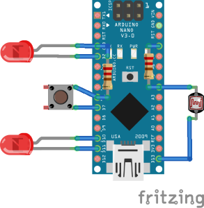

## Why
I created this script to control two sets of mono color LEDs via an arduino that accepts commands from a button, a brightness sensor and directly from the PC.

## External Resources
I use [this](https://github.com/QuentinCG/Arduino-Light-Dependent-Resistor-Library) library for light detector

## Scheme

